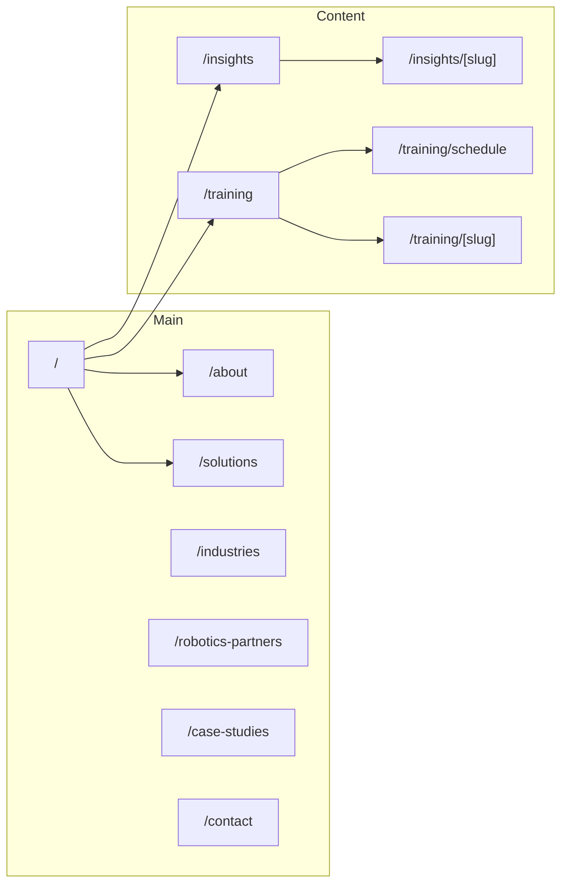

# iRobo Physical AI Website Plan

## Scope

- **Stack**: Next.js (App Router), with placeholder **[Company Name]** kept in content.
- **Source**: All structure and copy from [webcontnet.md](webcontnet.md), expanded with more detail, internal links, and new training/education flows.

---

## 1. Project setup and global structure

- Initialize Next.js (App Router, TypeScript, Tailwind CSS).
- Add shared layout: header nav, footer, SEO meta component.
- Define **route structure** and ensure every page is linked from nav/footer and relevant CTAs.

**Route map:**

---

## 2. Page implementation (blueprint → Next.js)

Implement each blueprint page as a Next.js page/component, with **expanded content** where the blueprint is brief.

| Blueprint page    | Next.js route        | Content additions                                                                                                                                                                                                     |
| ----------------- | -------------------- | --------------------------------------------------------------------------------------------------------------------------------------------------------------------------------------------------------------------- |
| Homepage          | `/`                  | Keep hero, Physical AI section, What We Do, Partners, Industries, Why Choose Us, CTA. Add short “Featured insights” (3 posts) and “Upcoming training” (2–3 items) with links to `/insights` and `/training/schedule`. |
| About             | `/about`             | Add “Our team,” “Where we operate” (regions from blueprint), and link to Training and Contact.                                                                                                                        |
| Solutions         | `/solutions`         | Expand each solution (Humanoid, Drones, Warehouse) with 2–3 bullets of use cases, benefits, and links to related case studies + training.                                                                             |
| Industries        | `/industries`        | One subsection per industry (Logistics, Manufacturing, Retail, Healthcare, Energy). Add 1–2 sentences each, key applications, and links to Solutions and relevant case studies.                                       |
| Robotics Partners | `/robotics-partners` | Partner list + short “Why we’re vendor neutral” and link to Solutions.                                                                                                                                                |
| Case Studies      | `/case-studies`      | One case study block per story (e.g. Global Retail Logistics). Add “Challenge / Solution / Result” and link to related industry and solution.                                                                         |
| Contact           | `/contact`           | Form (Name, Company, Email, Phone, Industry, Robotics Interest dropdown). CTA: “Schedule Robotics Consultation.” Link to Training for “Want to train your team?”.                                                     |

**Linking strategy:** Every major section will link to 1–2 related pages (e.g. Industries → Solutions, Case Studies → Industries, Contact → Training).

---

## 3. Blog / Insights

- **Route**: `/insights` (listing) and `/insights/[slug]` (article).
- **Content**: Use blueprint examples as first articles:
  - “The Future of Humanoid Robots in Logistics”
  - “How AI is Transforming Industrial Robotics”
  - “Deploying Robots Safely in Enterprise Environments”
  - “Top 10 Use Cases for Physical AI”
- **Details to add**: 2–3 paragraphs per post, subheadings, 1–2 internal links to Solutions/Industries/Training, and “Related posts” at the bottom.
- **Data**: Store posts as MD/MDX or JSON in `content/insights/`; render with a simple parser or `next-mdx-remote` for MDX.
- **Links**: Header nav “Insights,” footer “Blog,” homepage “Featured insights” → `/insights` and individual posts.

---

## 4. Education / Training

- **Training hub** (`/training`):
  - Headline and short value proposition (e.g. “Upskill your team for the physical AI era”).
  - List of offerings with short descriptions and links to detail/schedule:
    - **Workforce robotics training** (operations, safety, basic maintenance)
    - **Technical integration workshops** (for engineers: APIs, fleet tools, WMS/ERP)
    - **Leadership / strategy workshops** (ROI, change management, roadmap)
  - CTA: “View schedule” → `/training/schedule`, “Contact us” → `/contact`.
- **Schedule** (`/training/schedule`):
  - Table or list: course name, format (onsite/virtual), duration, next dates (placeholder or CMS later), CTA “Register” or “Request for my team.”
  - Optional: “Request custom training” linking to Contact with pre-filled interest.
- **Course detail** (`/training/[slug]`):
  - One page per offering: objectives, audience, outline, duration, and link to schedule + contact.
- **Promotion**:
  - Homepage: “Upcoming training” block linking to `/training` and `/training/schedule`.
  - About: “We offer training” → `/training`.
  - Solutions / Industries: “Train your team” or “Explore training” → `/training`.
  - Contact: “Robotics Interest” dropdown includes “Training” or “Workforce training”; form success or sidebar can mention training.
  - Footer: “Training” link.

---

## 5. Assets and SEO

- **Images**: Use blueprint hero and stock links (Unsplash/Shutterstock) as `src` or download to `public/assets/images/` with proper alt text.
- **SEO**: Per-page `<title>` and `<meta name="description">`; blueprint example applied on homepage; similar patterns for Insights and Training.
- **Lead magnets**: “Download Physical AI Deployment Guide” etc. can be linked as CTAs (landing to contact or a simple “Download” form) without building full CRM in v1.

---

## 6. File and folder structure (summary)

- `app/(marketing)/page.tsx` — Home
- `app/(marketing)/about/page.tsx` — About
- `app/(marketing)/solutions/page.tsx` — Solutions
- `app/(marketing)/industries/page.tsx` — Industries
- `app/(marketing)/robotics-partners/page.tsx` — Partners
- `app/(marketing)/case-studies/page.tsx` — Case studies
- `app/(marketing)/contact/page.tsx` — Contact
- `app/(marketing)/insights/page.tsx` — Insights list
- `app/(marketing)/insights/[slug]/page.tsx` — Insight post
- `app/(marketing)/training/page.tsx` — Training hub
- `app/(marketing)/training/schedule/page.tsx` — Schedule
- `app/(marketing)/training/[slug]/page.tsx` — Course detail
- `components/` — Header, Footer, CTAs, cards, forms
- `content/insights/` — Blog post content (MD/MDX or JSON)
- `content/training/` — Training offerings and schedule data (JSON or MD)
- `public/assets/images/` — Hero and section images

---

## 7. Implementation order

1. Next.js init, layout, nav, footer, and global styles.
2. Homepage with all sections, placeholder “Featured insights” and “Upcoming training.”
3. About, Solutions, Industries, Partners, Case Studies, Contact (with internal links).
4. Insights: data layer + listing + 4 article pages with links.
5. Training: hub, schedule, and 3 course detail pages; add links from homepage, About, Solutions, Industries, Contact, footer.

No backend or CMS in scope; content in repo. Contact form can be client-only or wired to a service (e.g. Formspree) in a follow-up step.