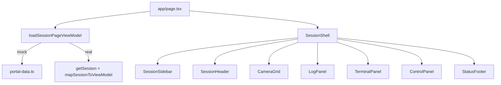

# Portal UI components, design tokens, and mock/real API wiring

## Current state

- Single-page layout and helpers live in [`/Users/saif/Projects/iRobo/portal/web/src/app/page.tsx`](/Users/saif/Projects/iRobo/portal/web/src/app/page.tsx) (sidebar, header, camera grid, logs, terminal, control rail, footer).
- Dummy content in [`/Users/saif/Projects/iRobo/portal/web/src/lib/mock/portal-data.ts`](/Users/saif/Projects/iRobo/portal/web/src/lib/mock/portal-data.ts).
- Typed REST helpers in [`/Users/saif/Projects/iRobo/portal/web/src/lib/api/client.ts`](/Users/saif/Projects/iRobo/portal/web/src/lib/api/client.ts) targeting `NEXT_PUBLIC_API_BASE_URL` (no auth header yet).
- Tailwind v4 theme hooks in [`/Users/saif/Projects/iRobo/portal/web/src/app/globals.css`](/Users/saif/Projects/iRobo/portal/web/src/app/globals.css) (`@theme inline`, minimal `--background` / `--foreground`).

## 1) Component split (presentation vs data)

Create a small **portal** component tree under `web/src/components/portal/` (names illustrative; adjust if you prefer `session/`):

| Component | Responsibility | Notes |
|-----------|----------------|--------|
| `SessionShell` | Outer chrome: max width, padding, main grid | Replaces root `main` + outer flex wrapper classes |
| `SessionSidebar` | Brand, robot card, End Session, nav | Props: `robot`, `navItems`, `activeNav`, callbacks (stub `onEndSession`) |
| `SessionHeader` | Session id, connection, uptime | Props: `session` summary |
| `CameraGrid` | Title row + 2x2 tiles | Props: `cameras[]`; optional `onFullscreen` later |
| `LogPanel` | Search UI + list | Props: `logs[]`; extract `severityPill` to `lib/portal/log-styles.ts` or colocate |
| `TerminalPanel` | Header + mono output | Props: `lines[]` |
| `ControlPanel` | Mode, d-pad, copy, stand/sit, e-stop | Props: `modeLabel`, `controlButtons` (or constant inside) |
| `StatusFooter` | Network / robot / battery / CPU / local time | Props: `status` |

**Page composition:** [`page.tsx`](/Users/saif/Projects/iRobo/portal/web/src/app/page.tsx) becomes a thin orchestrator: load view model (see section 3), pass props into the components above. Keeps Server Component by default unless you add interactive log search (then split interactive leaves as `"use client"`).



## 2) Design token layer (Tailwind v4)

**Goal:** stop scattering hex values like `#0b1220` across components; use **semantic** tokens (surface, panel, border, accent, danger, success, muted text).

**Approach (minimal, idiomatic for Tailwind v4 in this repo):**

1. In [`globals.css`](/Users/saif/Projects/iRobo/portal/web/src/app/globals.css), define CSS variables on `:root`, e.g. `--rc-surface`, `--rc-panel`, `--rc-border`, `--rc-accent`, `--rc-danger`, `--rc-text-muted`, `--rc-success`.
2. Extend `@theme inline` to map them to Tailwind color tokens, e.g. `--color-rc-surface: var(--rc-surface);` so components use `bg-rc-surface`, `border-rc-border`, `text-rc-text-muted`, etc.
3. Replace hard-coded colors in new components with these utilities.
4. Optional follow-up (not required for first pass): remove `prefers-color-scheme` override that currently fights the forced dark product UI, or redefine light tokens if you ever ship light mode.

**Small utility module:** `web/src/lib/portal/tokens.ts` exporting **class name fragments** only if you need composition (e.g. shared `panelClassName`). Prefer Tailwind utilities + CSS variables as the source of truth.

## 3) Mock / real toggle + API wiring

**Unified view model:** add `web/src/lib/portal/session-view-model.ts` defining a `SessionPageViewModel` (session header fields, robot card, cameras, logs, terminal lines, footer status). Mock data in [`portal-data.ts`](/Users/saif/Projects/iRobo/portal/web/src/lib/mock/portal-data.ts) is reshaped to satisfy this type (or the type matches existing mock shapes).

**Toggle mechanism (simple, professional):**

- Primary: `NEXT_PUBLIC_API_MODE=mock|real` (default `mock` for UI-first workflow).
- Session id for real mode: `NEXT_PUBLIC_SESSION_ID` (required when `real`).
- Base URL: keep `NEXT_PUBLIC_API_BASE_URL` as in [`client.ts`](/Users/saif/Projects/iRobo/portal/web/src/lib/api/client.ts).
- Auth: extend `request()` in `client.ts` to attach `Authorization: Bearer <token>` when `NEXT_PUBLIC_API_TOKEN` is set (empty in mock mode).

**Loader:** `loadSessionPageViewModel()` in `web/src/lib/portal/load-session-page.ts`:

- If `mock` → return mapped mock VM (sync).
- If `real` → call `getSession(sessionId)`; map OpenAPI `Session` (`id`, `state`, `safety_profile`, `robot_unit_id`, `studio_id`, `capabilities`, timestamps) into the VM:
  - Header: show `id`, derive a human `connection` string from `state` (`active` → Connected, `degraded` → Degraded, etc.), use `started_at` for uptime **or** show `state` + timestamps until a dedicated uptime field exists in API.
  - Sidebar robot: until API returns nested robot, show placeholders derived from ids (`robot_unit_id` truncated) and static camera/latency placeholders **or** a clear “Waiting for robot catalog API” empty state—your call in implementation; plan default keeps non-video placeholders so UI does not pretend false telemetry.

**Where to call loader:** `page.tsx` as `async` server component:

```ts
const vm = await loadSessionPageViewModel();
```

Document env vars in a short `web/README.md` section or comment block at top of `load-session-page.ts` (avoid large new docs unless you want them).

## 4) Typed client hygiene

- Keep [`generated.ts`](/Users/saif/Projects/iRobo/portal/web/src/lib/api/generated.ts) generated only via `npm run gen:api` (already in [`package.json`](/Users/saif/Projects/iRobo/portal/web/package.json)).
- Optionally add `getSessionOrThrow` wrapper that maps non-JSON errors for clearer UI error boundary later.

## 5) Verification

- `npm run lint` and `npm run build` in `web/`.
- Manual: `NEXT_PUBLIC_API_MODE=mock` renders identical layout; `real` with invalid base URL surfaces a controlled error (implement `try/catch` in loader returning a VM with a banner error state in `SessionHeader` or `SessionShell`).

## Files touched (expected)

- Refactor: [`web/src/app/page.tsx`](/Users/saif/Projects/iRobo/portal/web/src/app/page.tsx)
- New: `web/src/components/portal/*.tsx` (shell, sidebar, header, grids, panels)
- New: `web/src/lib/portal/session-view-model.ts`, `web/src/lib/portal/load-session-page.ts`, optional `web/src/lib/portal/map-session.ts`
- Update: [`web/src/lib/api/client.ts`](/Users/saif/Projects/iRobo/portal/web/src/lib/api/client.ts) (auth header)
- Update: [`web/src/app/globals.css`](/Users/saif/Projects/iRobo/portal/web/src/app/globals.css) (semantic tokens)
- Update: [`web/src/lib/mock/portal-data.ts`](/Users/saif/Projects/iRobo/portal/web/src/lib/mock/portal-data.ts) (align to VM or import mapper)
