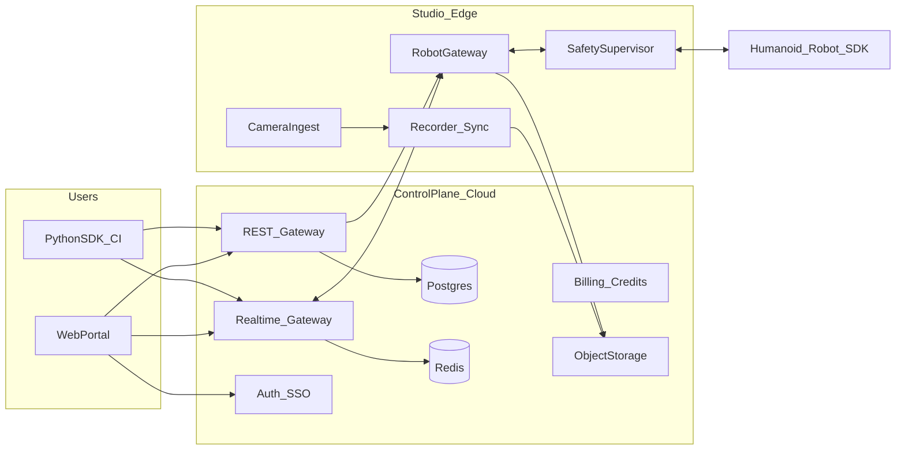
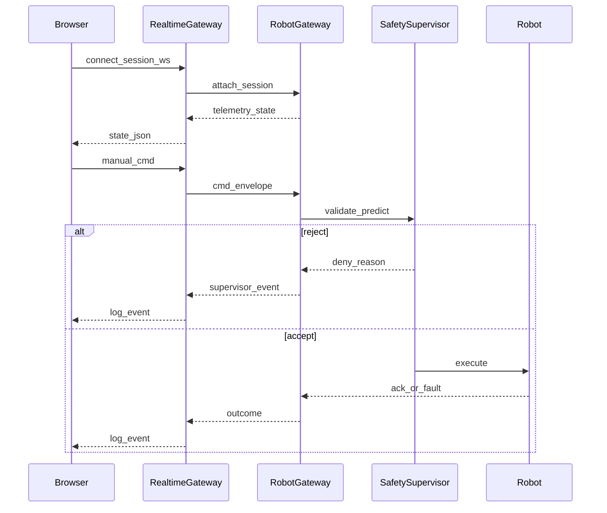

# RoboCloud Session Portal: PRD, Technical Design, and Build Plan

## Sources consolidated

- First-call deck: [RobotCloud_FCD_v3.pdf](/Users/saif/Projects/iRobo/portal/RobotCloud_FCD_v3.pdf) — positioning, “how it works,” fleet/studios, API-first, data collection, revenue tiers, structural advantages, VW-style case narrative.
- Product requirements export: [01_Product_requirements - Google Docs.pdf](/Users/saif/Projects/iRobo/portal/01_Product_requirements%20-%20Google%20Docs.pdf) — mission, problem statement, audiences (labs, students, ML engineers, enterprise); **Goals / Non-goals / Metrics sections are placeholders** in the export and should be filled using deck + journey docs.
- Persona journeys (Google Drive `03_Development`): `user_journey_research.md` (Maya — access, latency, safety supervisor, session bundle export, standardized API across robots) and `user_journey_consultant.md` (Julien — SSO, PO billing, EU residency, studio parity, benchmark harness, evidence packages).
- UI reference: saved mockup [robot_app_UI-e6427693-a59c-410a-a07e-cb9ad208cfa2.png](/Users/saif/.cursor/projects/Users-saif-Projects-iRobo-portal/assets/robot_app_UI-e6427693-a59c-410a-a07e-cb9ad208cfa2.png) — **RoboCloud** branding, session header (session id, connected, timer), sidebar (robot context, End Session, nav: Overview / Control / Files / Data Recordings / API Access / Settings, studio context), main **4-camera grid**, **control panel** (mode, D-pad, key bindings, Stand/Sit, E-stop), **logs** + **terminal**, footer health strip.

**Repo note:** [portal](/Users/saif/Projects/iRobo/portal) currently has no application source in workspace search; treat the portal as **greenfield** unless you add an existing app subtree later.

---

## Part A — Product Requirements Document (what to write)

### A1. Product summary

- **Product:** RoboCloud — on-demand **Robot-as-a-Service**: browse fleet + studios, reserve time, run remote experiments via **dashboard + API**, observe via **multi-camera telemetry**, control with **manual + API** modes under **safety supervision**, export **session bundles** for reproducibility and enterprise evidence.
- **Primary jobs-to-be-done:** (1) close sim-to-real with short real rollouts; (2) fair cross-robot benchmarks in standardized studios; (3) vendor-agnostic evaluation before procurement.

### A2. Personas and success criteria (from PRD + journeys)

| Persona | Primary outcome | Must-have product behaviors |
|--------|------------------|-----------------------------|
| Researcher (Maya) | Paper-grade data in one session | Low-latency observation, pause/resume, tagged trials, export bundle, budget/credits |
| Enterprise consultant (Julien) | Auditable comparability | SSO, PO billing, data residency, identical studio + harness across robots, scorecard-friendly exports |
| Platform operator (implicit) | Safe continuous utilization | Session lifecycle, incident response, utilization metrics, maintenance windows |

### A3. Scope: Session Control Portal (UI-aligned)

**In scope (MVP → v1):**

- **Authentication & org:** email/OIDC for individuals; **SSO (SAML/OIDC)** for enterprise; org/workspace; roles (Admin, Member, Operator read-only).
- **Session shell (matches mockup):** persistent layout: **header** (session id, connection state, timer, Report Issue, help, profile), **sidebar** (selected robot, battery/online, **End Session**, primary nav, studio selector), **main** Control view: **2×2 camera grid** with labels + fullscreen, **control rail**: mode selector (**Manual keyboard** / **API** / future **Teleop**), directional affordances + documented bindings, **Stand/Sit** (or platform-mapped primitives), **hardware E-stop latch** + **software E-stop**; **logs panel** (filters All/Info/Warn/Error/Debug, search, export snippet); **terminal panel** (session-scoped shell or file bridge + command history); **footer** telemetry strip (network, robot status, battery, CPU temp, local time — sources defined per robot/studio).
- **Booking & catalog (minimal for portal entry):** robot detail, studio detail, reserve slot, prepaid credits / invoice hooks (align with deck pricing bands).
- **API Access surface:** documented session token, WebSocket endpoints, REST for session metadata; Python client story (`RoboCloud(session=..., safety_profile=...)` from journey).
- **Data recordings:** start/stop recording, retention policy, download **session bundle** (multi-cam synced video, joint state JSONL, policy I/O traces, safety events — as stated in journeys).
- **Safety & compliance:** command validation layer, rate limits, torque/joint envelope profiles (**safety_profile**), audit log of operator actions, incident reporting flow.

**Explicit non-goals for v1 (suggested — align with stakeholders):**

- Full robot fleet ownership simulation in software; vendor-specific teleop beyond documented SDK mapping.
- On-robot training at scale (inference/eval focus first).
- Guaranteed sub-50 ms video globally (document targets vs. measured).

### A4. Functional requirements (numbered for traceability)

1. **FR-Session:** Create/resume/end session; session timer; reconnect with same session id where possible.
2. **FR-Observation:** Subscribe to N camera streams (default 4), per-tile fullscreen, per-stream latency indicator (where measurable).
3. **FR-Control-Manual:** Keyboard mapping; debounce; hold-to-move; mode switch requires explicit confirmation when robot is moving.
4. **FR-Control-API:** Session-scoped API keys or short-lived JWT; `observe()` / `execute(action)` semantics; idempotency keys for motion segments.
5. **FR-Safety:** Software E-stop; policy gate rejecting unsafe commands; auto re-home on fault; surface supervisor decisions in logs.
6. **FR-Logs:** Structured ingestion with severity; filter/search; correlation id per trial.
7. **FR-Terminal:** Bounded resource shell; upload/download for policy artifacts; optional SSH bridge behind enterprise policy.
8. **FR-Export:** Bundle manifest + checksum; PII minimization; org-level retention.
9. **FR-Enterprise:** SSO, SCIM (later), PO-based billing entity, region pinning for studios.
10. **FR-Support:** Report Issue captures session id, timestamps, last N log lines.

### A5. Non-functional requirements

- **Latency:** define SLOs separately for **control loop** (WS/API), **telemetry** (10–30 Hz state), **video** (target 150–300 ms glass-to-glass documented).
- **Availability:** session degradation modes (video-only, control disabled).
- **Security:** mTLS studio gateway; RBAC; secret rotation; WORM-ish audit for enterprise.
- **Compliance:** GDPR-style data handling; optional **EU-only** routing for studios (consultant journey).

### A6. Metrics (fill PRD placeholders)

- **Activation:** median time from login to first camera frame in session.
- **Reliability:** session completion rate; supervisor false-positive rate.
- **Value:** % sessions exporting bundles; repeat bookings within 14 days.
- **Enterprise:** SSO adoption; PO accounts; incident MTTR.

---

## Part B — Technical Design Document (architecture)

### B1. High-level system context

### B2. Session realtime data plane (portal-critical)

### B3. Video architecture (4-up grid)

- **Preferred v1:** **WebRTC** (SFU) for per-camera tracks; browser subscribes to four tracks; optional simulcast layers.
- **Alternate/fallback:** LL-HLS for resilience on restrictive networks; higher latency, simpler ops.
- **Sync:** server-side timestamp alignment in recorder; UI displays per-track latency estimate (RTCP stats).

### B4. Control API abstraction (standardized across brands)

- Define a **canonical action schema** (pose targets, joint deltas, named skills, gripper commands) + **embodiment adapter** in `RobotGateway` per vendor.
- Journeys require **same harness, different robot** — enforce **versioned** API contract and adapter compatibility matrix in docs.

### B5. Core services (suggested boundaries)

| Service | Responsibility |
|--------|------------------|
| **Web portal** | UI shell, session layout, auth integration, telemetry visualization |
| **REST API** | orgs, robots, studios, bookings, session metadata, exports |
| **Realtime gateway** | WS fan-in/out, rate limits, presence, terminal stream multiplex |
| **Robot gateway (edge)** | SDK integration, watchdog, time sync, local recording |
| **Safety supervisor** | envelopes, predictive checks, incident signals |
| **Recorder** | synchronized encodings, manifest writer, upload to object storage |

### B6. Data model sketch (Postgres entities)

- `Organization`, `User`, `Membership`, `Role`
- `RobotModel`, `RobotUnit`, `Studio`, `Booking`, `Session`
- `SessionArtifact` (files in object storage + checksums)
- `SafetyEvent`, `AuditLogEntry`

### B7. Security model

- Short-lived **session tokens** scoped to `session_id` + capabilities (`observe`, `control_manual`, `control_api`, `terminal`, `export`).
- **Edge gateway** authenticated to cloud via mTLS + device identity.
- **Enterprise:** SSO groups map to roles; optional IP allowlist.

---

## Part C — Recommended technology choices (best fit for described users)

**Rationale:** Researchers and enterprise integrators both need **typed APIs**, **predictable realtime**, **SSO**, and **operable** services — TypeScript end-to-end reduces friction; WebRTC SFU is the industry default for multi-stream low latency.

| Layer | Choice | Why |
|-------|--------|-----|
| **Portal UI** | **Next.js (App Router) + React + TypeScript** | Auth/session SSR, mature ecosystem, easy deployment |
| **UI kit** | **Tailwind CSS + headless components** (e.g., Radix) | fast dark dashboard like mockup |
| **Realtime** | **WebSocket server** (e.g., **Socket.IO** or **ws** behind same API org) + **protobuf/JSON** envelopes | terminal/logs/control multiplex |
| **Video** | **LiveKit** or **mediasoup** SFU | four tracks, simulcast, TURN for NAT |
| **Control plane API** | **NestJS** (modules: auth, billing, sessions) *or* **Fastify** if you want lighter weight | structured modules, guards, OpenAPI |
| **Edge gateway** | **Go** *or* **Rust** for robot IO + strict latency *or* **Python** if vendor SDKs are Python-first (wrap in subprocess) | pick based on dominant SDK language for v1 robots |
| **Data** | **PostgreSQL** + **Redis** | sessions, bookings, ephemeral presence |
| **Objects** | **S3-compatible** (GCS/R2/S3) | bundles, recordings |
| **Auth** | **Auth0 / Stytch / Keycloak** | SSO + social + orgs |
| **Observability** | **OpenTelemetry** + structured logs | incident debugging, SLOs |

**Persona alignment:** Maya needs **fast iteration** → Next.js + Python SDK + good WebRTC; Julien needs **SSO, audit, residency** → OIDC/SAML, regional deployment, immutable export manifests — all compatible with the above.

---

## Part D — Implementation plan (phased)

### Phase 0 — Foundations (1–2 weeks)

- OIDC login, org/workspace skeleton, design tokens matching mockup.
- Postgres schema for `Session`, `RobotUnit`, `Studio` (read-only catalog).

### Phase 1 — Session shell + fake robot (2–3 weeks)

- Implement UI layout parity with mockup using **mock streams** (MP4 loop) + mocked telemetry.
- WS channel with typed messages: `state`, `log`, `control_ack`, `supervisor`.

### Phase 2 — Real robot path (4–8 weeks, parallelizable)

- Edge `RobotGateway` for first robot family; safety supervisor MVP; manual keyboard commands.
- WebRTC ingest from studio cameras (or bridge from existing RTSP).

### Phase 3 — API + SDK (3–5 weeks)

- Public REST + WS contract; Python client; CI example “20 trials” harness.

### Phase 4 — Recording + export (3–6 weeks)

- Sync recording pipeline, bundle builder, download portal.

### Phase 5 — Enterprise hardening (ongoing)

- SAML, PO billing integration, EU region pinning, SOC2-oriented controls.

---

## Part E — Deliverable files to produce in-repo (after plan approval)

When you exit plan-only mode and ask to implement documentation, add (paths suggested):

- [docs/PRD_RoboCloud_Session_Portal.md](/Users/saif/Projects/iRobo/portal/docs/PRD_RoboCloud_Session_Portal.md)
- [docs/TDD_RoboCloud_Session_Portal.md](/Users/saif/Projects/iRobo/portal/docs/TDD_RoboCloud_Session_Portal.md) (includes mermaid diagrams + OpenAPI outline)
- [docs/adr/0001-video-sfu-choice.md](/Users/saif/Projects/iRobo/portal/docs/adr/0001-video-sfu-choice.md) (LiveKit vs mediasoup decision record)

These translate this plan into copy-pasteable stakeholder docs and engineering specs.
