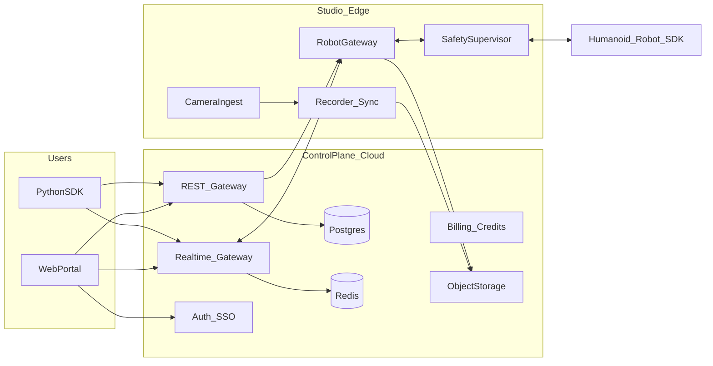
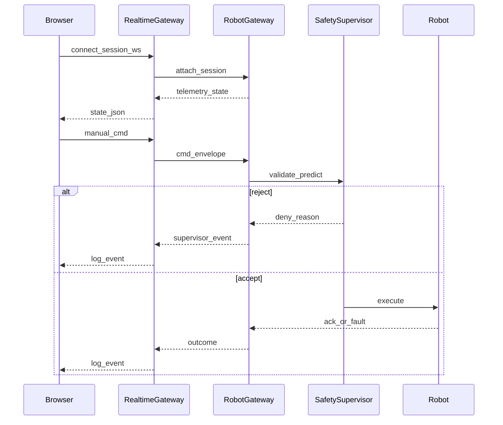

# RoboCloud Session Portal — Technical Design Document

**Version:** 1.0  
**Status:** Draft  
**Audience:** Engineering, Security, SRE  
**Companion:** [PRD_RoboCloud_Session_Portal.md](./PRD_RoboCloud_Session_Portal.md)

---

## 1. Design goals

1. **Separation of planes:** browser talks to **cloud control plane**; robots talk only to **studio edge** (gateway + supervisor).
2. **One session, many channels:** WebRTC for video; WebSocket (or WebTransport later) for logs, terminal, control, and telemetry.
3. **Versioned contracts:** canonical action schema + per-vendor **embodiment adapters** at the gateway.
4. **Defensible evidence:** immutable-enough audit + export manifests for enterprise and research users.

---

## 2. System context



### 2.1 Service responsibilities

| Component | Owns | Notes |
|-----------|------|--------|
| **Web portal** | UI shell, WebRTC client, WS client, local UX state | No direct robot IPs in browser |
| **REST API** | Orgs, users, catalog, bookings, sessions, artifacts metadata | OpenAPI: [openapi/robocloud-session.yaml](./openapi/robocloud-session.yaml) |
| **Realtime gateway** | WS fan-out, authz per session capability, backpressure | Horizontally scaled; sticky routing optional |
| **Auth / IdP** | SSO, OIDC, tokens | Session tokens minted after booking check |
| **Robot gateway (edge)** | SDK process, time sync, command queue, watchdog | mTLS to cloud |
| **Safety supervisor** | Envelopes, limits, predictive checks | Same binary or sidecar as GW |
| **Camera ingest** | RTSP/USB/NDI → WebRTC ingress or SFU upstream | See ADR |
| **Recorder** | Aligned encodings, segment files, manifest | Writes to object storage |

---

## 3. Session realtime sequence



---

## 4. WebRTC / video design

### 4.1 Topology

- **SFU** in studio region (see [adr/0001-video-sfu-choice.md](./adr/0001-video-sfu-choice.md)).
- **Four publisher tracks** (one per camera) or one publisher with four tracks; subscribers: browser portal (and optional cloud recorder subscriber).

### 4.2 Client behavior

- Subscribe to four tracks; map `track_id` → UI slot via server **SDP metadata** or REST `GET /sessions/{id}/webrtc/participant`.
- **Simulcast** optional for WAN.
- **TURN** in same region as SFU for enterprise NAT.

### 4.3 Latency display

- Poll `getStats()` RTT / jitter; show per-tile estimate or “n/a” if stats missing.

### 4.4 Fallback

- If WebRTC fails after N retries, offer **LL-HLS** playlist URLs (higher latency, labeled in UI).

---

## 5. WebSocket protocol (control plane ↔ browser/SDK)

### 5.1 Connection

- **URL:** `wss://rt.robocloud.example/v1/sessions/{session_id}/stream`
- **Subprotocol:** `robocloud.v1+json` (JSON text frames for v1).
- **Auth:** `Authorization: Bearer <session_rt_token>` on HTTP upgrade; token encodes **capabilities**: `observe`, `control_manual`, `control_api`, `terminal`, `export`.

### 5.2 Envelope (all messages)

```json
{
  "v": 1,
  "id": "msg_ulid",
  "ts": "2026-05-05T12:00:00.000Z",
  "type": "string",
  "correlation_id": "optional_ulid",
  "payload": {}
}
```

### 5.3 Client → server message types

| `type` | `payload` (summary) | Capability |
|--------|---------------------|------------|
| `session.ping` | `{}` | any |
| `control.manual` | `{ "intent": "move_forward", "pressed": true }` | `control_manual` |
| `control.skill` | `{ "skill": "stand" }` | `control_manual` or `control_api` |
| `control.api_command` | `{ "idempotency_key": "...", "action": { ... canonical ... } }` | `control_api` |
| `terminal.input` | `{ "data": "base64_or_utf8_chunk" }` | `terminal` |
| `terminal.resize` | `{ "cols": 120, "rows": 40 }` | `terminal` |
| `log.subscribe` | `{ "levels": ["info","warn","error"] }` | `observe` |

### 5.4 Server → client message types

| `type` | `payload` (summary) |
|--------|---------------------|
| `session.ready` | `{ "robot_unit_id", "safety_profile", "capabilities" }` |
| `telemetry.state` | `{ "battery", "joints", "pose", "temperatures", ... }` |
| `log.event` | `{ "level", "source", "message", "trial_id?", "structured?" }` |
| `supervisor.event` | `{ "decision": "reject\|clamp\|rehome", "reason_code", "detail" }` |
| `control.ack` | `{ "idempotency_key?", "status": "accepted\|rejected", "reason?" }` |
| `terminal.output` | `{ "data": "..." }` |
| `session.error` | `{ "code", "message", "fatal": true/false }` |

### 5.5 Rate limits (gateway enforced)

- `control.manual`: max **N** intents/sec per session (burst allowed for key repeat).
- `control.api_command`: stricter token bucket; idempotency dedup window **60s**.
- `terminal.input`: max bandwidth **K** KB/s.

---

## 6. Canonical control action schema (API boundary)

Versioned JSON schema `https://robocloud.dev/schemas/action/v1.json` (conceptual):

- **Primitives:** `joint_delta`, `joint_target`, `cartesian_twist`, `named_skill`, `gripper`, `estop`.
- Each action includes optional `frame_id` (world vs. base) and `duration_ms` for timed segments.
- **Embodiment adapter** maps canonical → vendor SDK at `RobotGateway`.

Example (illustrative):

```json
{
  "type": "named_skill",
  "skill": "sit",
  "params": {}
}
```

---

## 7. Safety supervisor interface (internal)

### 7.1 Inputs

- Latest **robot state** (joints, torques, IMU, contact estimates if available).
- **Safety profile** (workspace AABB, max joint velocity, max cartesian speed, allowed skills whitelist).
- **Command envelope** (canonical action + user/org + session).

### 7.2 Outputs

- `allow` | `reject` | `clamp` (with modified envelope) | `rehome_required`.
- Structured `reason_code` for logs and trial scoring (e.g., `TORQUE_LIMIT`, `WORKSPACE_VIOLATION`).

### 7.3 Predictive gate (v1)

- Pluggable hook: optional fast simulator or analytic bound; if unavailable, **conservative** static limits only.

---

## 8. Data model (PostgreSQL)

| Table | Key fields |
|-------|------------|
| `organizations` | id, name, billing_entity_type, region_default |
| `users` | id, email, idp_subject |
| `memberships` | org_id, user_id, role |
| `robot_models` | id, vendor, specs_json, adapter_version |
| `robot_units` | id, model_id, studio_id, status |
| `studios` | id, region, spec_json, calibration_artifact_urls |
| `bookings` | id, org_id, unit_id, start, end, price_snapshot |
| `sessions` | id, booking_id, state, started_at, ended_at, safety_profile |
| `session_artifacts` | id, session_id, s3_uri, sha256, type (`bundle_manifest`, `mp4`, `jsonl`, …) |
| `safety_events` | id, session_id, ts, reason_code, payload_json |
| `audit_log_entries` | id, session_id, actor, action, payload_hash |

Redis keys (examples):

- `session:{id}:presence` — connected clients count.
- `session:{id}:rate:control` — token bucket counters.

---

## 9. REST API surface (outline)

See [openapi/robocloud-session.yaml](./openapi/robocloud-session.yaml). Summary:

- `POST /v1/sessions` — start from booking.
- `GET /v1/sessions/{session_id}` — metadata + capabilities.
- `POST /v1/sessions/{session_id}/webrtc/token` — SFU join token.
- `POST /v1/sessions/{session_id}/recordings` — start/stop.
- `GET /v1/sessions/{session_id}/artifacts` — list bundles.

---

## 10. Threat model (summary)

| Threat | Mitigation |
|--------|------------|
| Stolen session token | Short TTL, refresh via REST; bind to device fingerprint optional; revoke on end |
| Token scope escalation | JWT claims = capability bitmask; gateway enforces |
| MITM | TLS 1.2+; cert pinning optional in native SDK |
| Malicious file upload | Size limits, MIME sniff, async malware scan, quarantine |
| Robot command injection | Canonical schema validation; supervisor; no shell from robot |
| Edge impersonation | mTLS + device identity; hardware TPM optional |
| Log PII leakage | Redaction pipeline; configurable retention |

---

## 11. SLOs / SLIs (proposed)

| SLI | Target (initial) |
|-----|------------------|
| REST availability (catalog + session meta) | 99.5% monthly |
| WS session attach success | 99% within 2 attempts |
| Video **first frame** after subscribe | P95 &lt; 5s (network dependent) |
| Control command P95 (cloud+edge LAN) | &lt; 150 ms (measure per region) |

---

## 12. Observability

- **OpenTelemetry** traces: span `ws.attach`, `gw.execute`, `supervisor.validate`.
- Structured logs with `session_id`, `org_id`, `robot_unit_id`.
- Metrics: command reject rate, E-stop presses, recording failures, SFU bitrate.

---

## 13. Deployment topology

- **Regional** deployments: EU control plane + EU edge studios for residency-sensitive orgs.
- **Realtime gateway** colocated with SFU region to minimize cross-region hops.

---

## 14. Related artifacts

- [openapi/robocloud-session.yaml](./openapi/robocloud-session.yaml)  
- [sdk/python_robocloud_outline.md](./sdk/python_robocloud_outline.md)  
- [adr/0001-video-sfu-choice.md](./adr/0001-video-sfu-choice.md)  
- [ROADMAP_MVP_ACCEPTANCE.md](./ROADMAP_MVP_ACCEPTANCE.md)  
